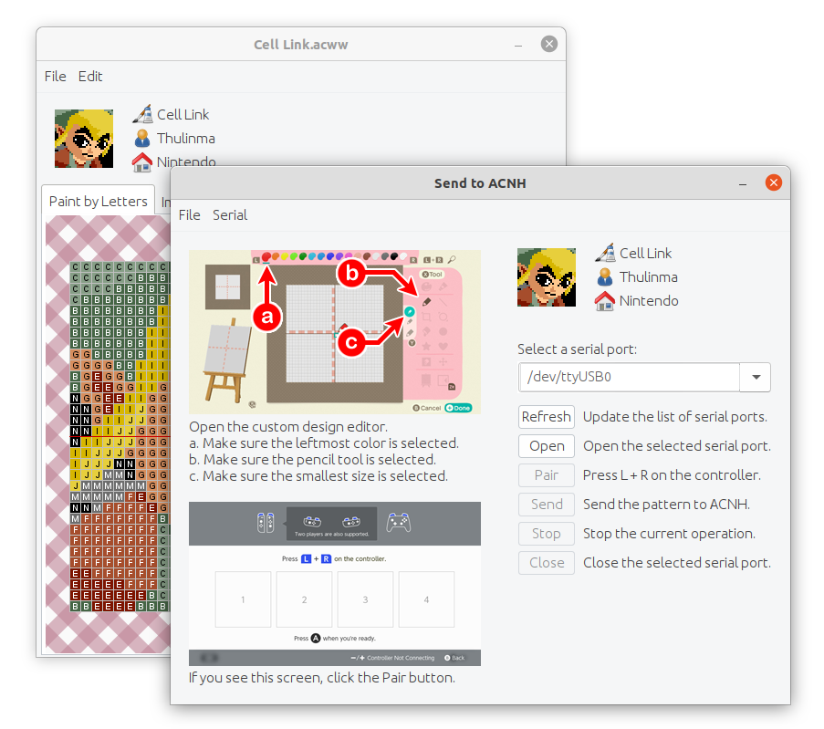

# Animal Prints

Animal Prints can open Animal Crossing design patterns in many formats (.acnh, .acnl, and .acww files; ACNL QR codes; and generic image files), convert patterns between these formats, and save patterns in these formats, as well as produce paint-by-letter instructions.

## Send to ACNH

Using a USB-to-serial adapter and a microcontroller with custom firmware to emulate a Switch controller, Animal Prints can automate the creation of design patterns in-game.

To use the Send to ACNH feature, you will need:

* A Nintendo Switch and a copy of Animal Crossing: New Horizons (duh)
* A microcontroller with built-in USB capabilities
  * We recommend a [Sparkfun Pro Micro](https://www.sparkfun.com/products/12640) or [Adafruit ItsyBitsy 32u4](https://www.adafruit.com/product/3677), which use the ATmega32u4 microcontroller.
  * You can also use an [Arduino Uno](https://store.arduino.cc/usa/arduino-uno-rev3) or [Arduino Mega](https://store.arduino.cc/usa/mega-2560-r3), which use the ATmega16u2 microcontroller for USB; however, consider:
    * The main CPU, the ATmega328P or ATmega2560, will not be used, so this is overkill.
    * Many clones use a dedicated USB controller chip which cannot be programmed; such clones will not work for this purpose.
  * Other microcontrollers supported by [LUFA](http://www.fourwalledcubicle.com/LUFA.php) can be used, but you'll need to compile [the firmware](https://github.com/RebeccaRGB/Switch-Fightstick) yourself.
* A USB-to-serial adapter, such as the [Adafruit FTDI Friend](https://www.adafruit.com/product/284)

### Using a Sparkfun Pro Micro or Adafruit ItsyBitsy 32u4

* Download the file `Joystick_m32u4.hex` in the `firmware` directory. (You can also save a copy from the File menu in the Send to ACNH window.)
* Use [ATMEL FLIP](https://www.microchip.com/developmenttools/ProductDetails/FLIP) or `avrdude` to upload the `Joystick_m32u4.hex` firmware to the microcontroller.
* Connect the microcontroller's `GND`, `VCC`, `RX` and `TX` pins to the USB-to-serial adapter's `GND`, `VCC`, `TX` and `RX` pins. (`RX` and `TX` are switched. `CTS`, `RTS`, and `DTR` can be left unconnected.) 
* Connect the USB-to-serial adapter's USB port to your computer's USB port.
* Connect the microcontroller's USB port to your Switch's USB port.
* Open the custom design editor in ACNH.
  * Make sure the leftmost color is selected.
  * Make sure the pencil tool is selected.
  * Make sure the smallest pencil size is selected.
* Open the Send to ACNH window. Select the USB-to-serial adapter from the list of serial ports, and click the Open button.
* If you see the screen on the Switch that says "Press L + R on the controller," click the Pair button.
* Click the Send button to make the magic happen!
* Once finished, click the Close button.

### Using an Arduino Uno or Arduino Mega

* Please note, this will not work with many Arduino clones that use a dedicated USB controller chip instead of an ATmega16u2. For the best results, use an authentic board.
* Download the file `Joystick_m16u2.hex` in the `firmware` directory. (You can also save a copy from the File menu in the Send to ACNH window.)
* Download and install ATMEL FLIP from https://www.microchip.com/developmenttools/ProductDetails/FLIP
* Connect the Arduino.
* Short the two male header pins on the Arduino closest to the USB port for a few seconds. (If you're on Windows, you should hear the "device disconnected" sound when connecting the pins and the "device connected" sound when disconnecting the pins.)

* Open ATMEL FLIP.
* Click the button for "Select a Target Device" and select ATmega16U2.
* Click the button for "Select a Communication Medium" and select USB, then click Open.
* Go to Buffer > Options. Make sure "Reset Buffer Before Loading" is set to Yes and "Address Programming Range" is set to Whole Buffer.
* If this is your first time doing this:
  * Click the button for "Read Target Device Memory".
  * Click the button for "Save Buffer As HEX File" and save it as, for example, `arduino.hex`. (You can use this file later to turn your Arduino from a Switch controller back into an Arduino.)
* Click the button for "Load HEX File" and select the `Joystick_m16u2.hex` file.
* Click the Run button.
* Once the programming is done, disconnect the Arduino.
* Connect the Arduino's `GND`, `VCC`, `RX` and `TX` pins to the USB-to-serial adapter's `GND`, `VCC`, `TX` and `RX` pins. (`RX` and `TX` are switched. `CTS`, `RTS`, and `DTR` can be left unconnected.) 
* Connect the Arduino's `RESET` pin to `GND`. This will stop the main CPU from running and potentially interfering with things.
* Connect the USB-to-serial adapter's USB port to your computer's USB port.
* Connect the Arduino's USB port to your Switch's USB port.
* Open the custom design editor in ACNH.
  * Make sure the leftmost color is selected.
  * Make sure the pencil tool is selected.
  * Make sure the smallest pencil size is selected.
* Open the Send to ACNH window. Select the USB-to-serial adapter from the list of serial ports, and click the Open button.
* If you see the screen on the Switch that says "Press L + R on the controller," click the Pair button.
* Click the Send button to make the magic happen!
* Once finished, click the Close button.

## Acknowledgements

Special thanks to:
* [Thulinma](https://github.com/thulinma/) for [ACNLPatternTool](https://github.com/Thulinma/ACNLPatternTool)
* [Cuyler36](https://github.com/cuyler36) for [ACSE](https://github.com/Cuyler36/ACSE)
* [StackZ](https://github.com/superSaiyajinStackZ/) for [LeafEdit-Core](https://github.com/SuperSaiyajinStackZ/LeafEdit-Core)
* Dean Camera for [LUFA](http://www.fourwalledcubicle.com/LUFA.php)
* [progmem](https://github.com/progmem) for [Switch-Fightstick](https://github.com/progmem/Switch-Fightstick)
* [ItsDeidara](https://github.com/ItsDeidara) for [CommunityController](https://github.com/ItsDeidara/CommunityController)
