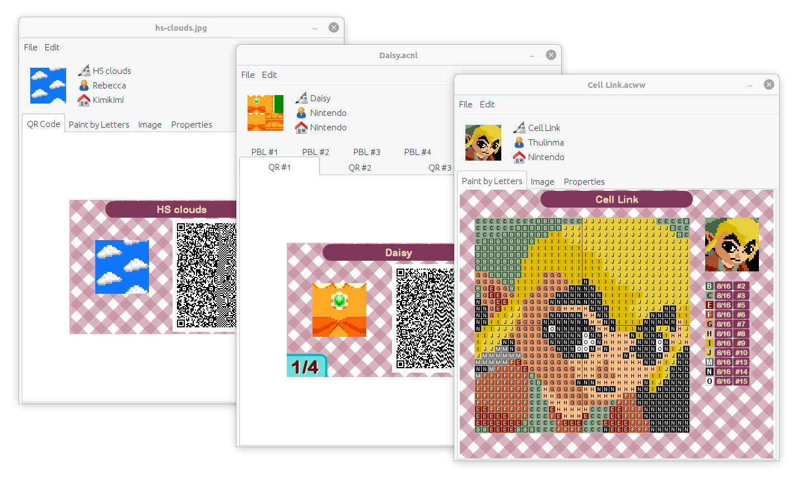

# Animal Prints

Animal Prints can open Animal Crossing design patterns in many formats (.acnh, .acnl, and .acww files; ACNL QR codes; and generic image files), convert patterns between these formats, and save patterns in these formats, as well as produce paint-by-letter instructions.

## Send to ACNH

Using a USB-to-serial adapter and a microcontroller with custom firmware to emulate a Switch controller, Animal Prints can automate the creation of design patterns in-game.

## Acknowledgements

Special thanks to:
* [Thulinma](https://github.com/thulinma/) for [ACNLPatternTool](https://github.com/Thulinma/ACNLPatternTool)
* [Cuyler36](https://github.com/cuyler36) for [ACSE](https://github.com/Cuyler36/ACSE)
* [StackZ](https://github.com/superSaiyajinStackZ/) for [LeafEdit-Core](https://github.com/SuperSaiyajinStackZ/LeafEdit-Core)
* Dean Camera for [LUFA](http://www.fourwalledcubicle.com/LUFA.php)
* [progmem](https://github.com/progmem) for [Switch-Fightstick](https://github.com/progmem/Switch-Fightstick)
* [ItsDeidara](https://github.com/ItsDeidara) for [CommunityController](https://github.com/ItsDeidara/CommunityController)
